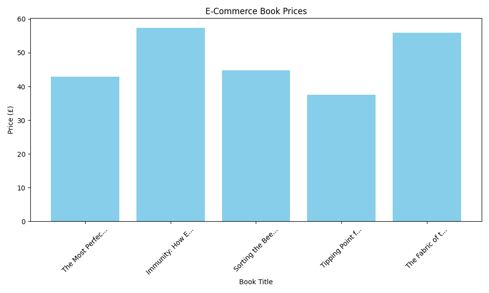

# ⚙️ Python Automation & Data Engineering Portfolio

**Gaurav Avhad** | Python Automation Engineer
[LinkedIn](https://www.linkedin.com/in/gauravavhad-python) | Mumbai, India

Welcome to my technical portfolio. This repository contains industrial-grade Python automation scripts and data pipelines designed to eliminate manual workflows, enhance system monitoring, and securely manage enterprise data.

---

## 🚀 Featured Projects

### 1. E-Commerce Price Intelligence & ETL Pipeline

An end-to-end Extract, Transform, Load (ETL) data pipeline that tracks competitor pricing in real-time, stores it securely, and generates automated visual reports.

- **Tech Stack:** Python 3.12, BeautifulSoup4, SQLite, Matplotlib, Requests
- **Architecture & Features:**
  - **Extract:** Bypasses anti-bot mechanisms using dynamic User-Agent rotation.
  - **Transform:** Cleans raw HTML string data, resolving UTF-8 encoding artifacts and casting strings to mathematical floats.
  - **Load:** Stores structured data into a relational **SQLite database** using parameterized queries to prevent SQL injection.
  - **Visualize:** Generates automated, dynamic bar charts using **Matplotlib** for rapid market analysis.

### 2. AI-Powered Log Auditor & Analytics System

An automated log parsing tool that processes server logs using advanced Regex patterns to detect and diagnose system failures.

- **Tech Stack:** Python 3.12, Google Gemini GenAI API, Regex
- **Architecture & Features:** - Replaces manual log tailing by hunting specific error flags (e.g., 404/500).
  - Integrates Large Language Models (LLMs) via REST API to provide automated Root Cause Analysis (RCA) on server errors, drastically reducing manual L2 triage time.

### 3. SecureVault - Encrypted Password Management

A secure Command Line Interface (CLI) credential manager implementing AES-256 symmetric encryption.

- **Tech Stack:** Python 3.12, Cryptography (Fernet), File I/O
- **Architecture & Features:** - Utilizes zero-knowledge architecture and secure file I/O to ensure credentials are never exposed in plain text.
  - Implements full CRUD (Create, Read, Update, Delete) operations with robust error handling for a seamless terminal user experience.

---

## 🛠️ Technical Capabilities

- **Core:** Python 3.12, SQL, Java
- **Data Engineering:** ETL Pipelines, Relational Databases (SQLite), Data Visualization (Matplotlib), Web Scraping (BeautifulSoup4)
- **Automation & Ops:** Regex Log Parsing, File I/O, Automated Workflows, Splunk/AWS CloudWatch concepts
- **Security:** AES-256 Encryption, Parameterized SQL Queries, Secure API Integration
